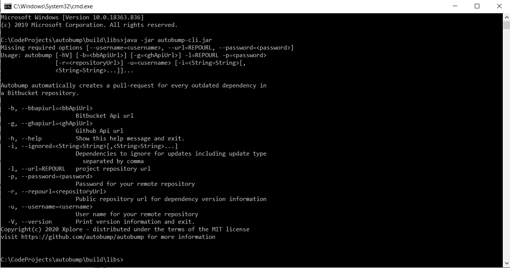
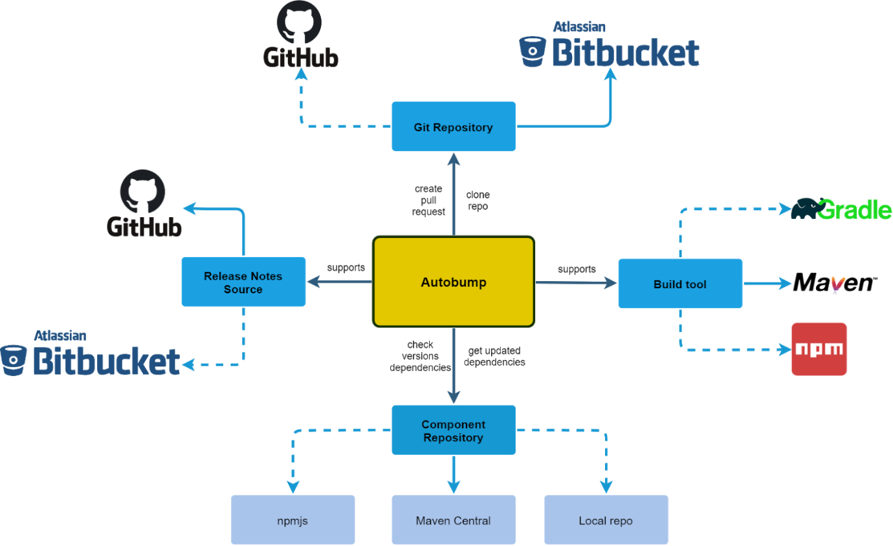

Table of contents
=================
  * [Description of Autobump](#description-of-autobump)
    + [What is Autobump?](#what-is-autobump)
    + [What problem does Autobump solve?](#what-problem-does-autobump-solve)
    + [How does Autobump accomplish its goals?](#how-does-autobump-accomplish-its-goals)
    + [Support](#support)
    + [Autobump clients](#autobump-clients)
      - [Autobump Spring boot](#autobump-spring-boot)
      - [Command line interface](#command-line-interface)
    + [How to configure Autobump](#how-to-configure-autobump)
  * [Analysis](#analysis)
    + [Uses cases](#uses-cases)
    + [Architecture](#architecture)
    + [C4-architecture](#c4-architecture)
      - [Context](#context)
      - [Component](#component)
      - [Code](#code)
    + [Hexagon-architecture](#hexagon-architecture)
    + [Opportunities for extending the Autobump](#opportunities-for-extending-the-autobump)
      - [architecture](#architecture)
  * [Description of modules](#description-of-modules)
    + [Core](#core)
    + [Maven](#maven)
    + [Bitbucket](#bitbucket)
    + [Github](#github)
    + [JGit](#jgit)
    + [CLI](#cli)
    + [Spring-boot](#spring-boot)
    + [External dependencies](#external-dependencies)
  * [Build guidelines](#build-guidelines)
    + [PMD & checkstyle](#pmd--checkstyle)
    + [Jacoco](#jacoco)
    + [Github Actions](#github-actions)
      - [Main workflow](#main-workflow)
      - [Sonarcloud pr](#sonarcloud-pr)
      - [Sonarcloud](#sonarcloud)
  * [Deployment guidelines](#deployment-guidelines)
    + [General guidelines](#general-guidelines)
    + [Deploy guidelines](#deploy-guidelines)
  * [Guidelines for the developer](#guidelines-for-the-developer)
    + [Bitbucket integration](#bitbucket-integration)
    + [Authentication](#authentication)
    + [Bitbucket Connect App scopes](#bitbucket-connect-app-scopes)
    + [Use Case refactor](#use-case-refactor)
    + [Main flows of business logic](#main-flows-of-business-logic)
      - [AutobumpUsecase](#autobumpusecase)
      - [RebaseUsecase](#rebaseusecase)

## Description of Autobump ##

### What is Autobump? ###

Autobump is a bot that automatically creates pull-requests to keep
dependencies of your projects up to date. It scans the dependency files,
and automatically detects out-of-date dependencies using the the configured repository. It then creates a pull-request for every outdated dependency.

### What problem does Autobump solve? ###

It is important to regularly keep the dependencies of your projects up
to date. External libraries are habitually updated to solve security
issues and other vulnerabilities, and to enhance features. However, it
is time consuming and not very exciting to be checking for updates,
adjusting the build files and testing whether everything still runs as
it should. When developers wait too long with these necessary updates,
they not only fail to take advantage of improved features, but also risk
breaking things once they finally do make the necessary bumps. Autobump
takes this arduous task off the plate of developers. It incrementally
updates all dependencies when new versions are released. Autobump relies
on the existing build pipelines of the repository to test whether
anything breaks when the update is implemented.

### How does Autobump accomplish its goals? ###

Autobump makes a temporary git clone of your Bitbucket repository and
extracts the build file where all dependencies are described. It then
extracts all dependencies and checks whether new versions are available
in the Maven Central Repository. If a new version has indeed been
released, Autobump creates a new branch in the repository, updates the
build file and commits and pushes the new branch to your remote
repository. It then creates a pull request, and includes release notes
of the new version if they are available on GitHub. If the build
pipeline in your repository succeeds, you may merge the new pull request
with the click of a button in Bitbucket. The flow is visualised in
figure XXX below.

>	Figure XXX. Flow of Autobump

### Support ###

Autobump currently supports:

- Build tool: Maven
- Repositories: Maven Central
- Git Providers: Bitbucket
- Release Notes Sources: GitHub

### Autobump clients ###

To date, Autobump includes two clients: a command line interface and a
spring boot web app, that is integrated in BitBucket as a BitBucket
Cloud app.

#### Autobump Spring boot ####

Alternatively, you can use Autobump Spring boot, a Bitbucket Cloud app
that is integrated in your Bitbucket Workspace. When you go to
[https://prod.autobump.be](https://prod.autobumpbe) you
can hit the install-button (Image XXX). 

>	Image XXX. Page to install Autobump in a BitBucket workspace.

Once you are authenticated in BitBucket, you are prompted to grant
Autobump access to your BitBucket workspace (Image XXX). 

If you click 'Grant Access', you land on the homepage of the Autobump
dashboard, where all the repositories of your BitBucket workspace are
listed. You can now select the repositories you want Autobump to monitor
(image XXX).

>	Image XXX. List of the repositories in a BitBucket workspace, imported
in Autobump.

>	Image XXX. Page to configure or bump repositories.

After saving, you can then hit the 'Bump now!' button to run Autobump
for your repositories. If your repositories contain outdated
dependencies, you will soon see the first pull requests appear in your
BitBucket workspace! If notes on the new release are available in
Github, they are included as a comment in the pull request (image XXX)

>	Image XXX. A pull request issues by Autobump, that includes release
notes.

#### Command line interface ####

You can run the application through a command-line interface. To bump a
repository, enter your credentials (username and password of your
BitBucket account) and the url of the repository you want to have
bumped. In addition, you can specify dependencies you do not wish to
have bumped. You can also specify whether 'major' or 'minor' updates
need to be ignored. The help-page of the command-line interface is
depicted in Image XXX.

>	Image XXX. The help-page of Autobump commandline interface.

### How to configure Autobump ###

You can configure the settings of the Autobump Spring Boot application,
both by a dashboard and through commenting pull requests issued by
Autobump. In the dashboard, you can opt for having your repositories
monitored daily. It is also possible to enter the username of a
developer, who will be notified when Autobump has issued a new pull
request. 

>	Image XXX. Configuration page for a repository.

Autobump may be configured to ignore updates for minor or major releases
of particular dependencies. To that end, enter the comment "ignore this
major" or "ignore this minor" in the comment-field of the relevant pull
request upon declining it (image XXX). Autobump will then save this new
setting and display it in the dashboard (image XXX). If you decline a
pull request without adding a comment, Autobump will no longer create
pull requests for that particular version.

>	Image XXX. Using a comment on a pull request in BitBucket to configure
Autobump to ignore updates.

>	Image XXX. Configuration page of a repository, that displays ignored dependencies.

 
 

***

 
 

## Analysis ##

### Uses cases ###

*Create pull request*

As a developer I want Autobump to create a new pull request to bump a
dependency to the latest available version.

*Rebase pull requests*

As a developer I want Autobump to automatically rebase pull requests
when new commits are made onto the target branch.

*Comment \"Ignore this minor\"*

As a developer, I want to be able to comment \"Ignore this minor\" on a
Autobump pull request. Autobump should ignore all minor and patch
versions within the same range.

*Comment \"Ignore this major\"*

As a developer, I want to be able to comment on an Autobump PR with
\"Ignore this major\". Autobump should update its Settings and not
notify me again about updates within this major version range.

*Bitbucket Cloud App*

As a developer I want to integrate Autobump Spring Boot in my Bitbucket
Cloud workspace.

*Ignore update*

As a developer, when I close a pull request, I want Autobump to ignore
the bump and not notify me again about this update until a new version
of the same dependency is available.

*Supersede pull request*

As a developer, I want Autobump to automatically supersede existing pull
requests to avoid having to close outdated pull requests manually.

*Comment on superseded pull request*

As a developer, I want Autobump to leave a comment on a superseded pull
request, explaining that the pull request was superseded by another pull
request. The comment includes a link to the new pull request.

*Include release notes in the pull request description*

As a developer, I want Autobump to include release notes in the pull
request description if they are available in order to save time when
reviewing the pull request.

*Web dashboard*

As a developer, I want Autobump to provide me a minimal web dashboard
that allows me to configure which repositories to bump and modify the
configuration settings for those repositories.

*Schedule run*

As a developer I want Autobump to schedule a run for every repository
once per day.

*Assign reviewer*

As a developer, I want to be able to configure Autobump to assign a user
as reviewer for pull-requests that are created by Autobump.

### Architecture ###

### C4-architecture ###

In this project, we adopt the C4 model for visualising our software
architecture. The four C's denote Context, Containers, Component and
Code (or Classes). Each of these stands for a particular diagram that
maps on respective levels of abstraction and describes the software
system at varying levels of detail. On the highest level -- i.e. Context
-- the diagram visualises the software system in its wider context,
including its interactions with users and external systems. This diagram
is typically comprehensible for a wider audience with limited technical
knowledge, who want to get a general idea of the purpose of the
software. One level below, the Container diagram pictures the
collaboration between various 'containers', i.e. apps and data stores,
and how they collaborate. This diagram is especially pertinent to
microservice architectures, and therefore less applicable to our
purposes. Third, a diagram on Component-level visualises the internal
structure of one container. For instance, the dependencies among the
modules of a multi module application are typically visualised on this
level. Lastly, the Class diagram contains the highest level of detail.
The hierarchy of the C4-architecture is clarified by flowchart 1.

>	Figure XXX. Overview of the C4-architecture. the 'Container'-level has been excluded here, because it is less pertinent to the Autobump architecture.

#### Context ####

The main interactions between Autobump and external systems are depicted
in figure XXX. The business flow starts with a git clone in BitBucket
cloud. Autubump extracts all the dependencies for Maven projects, and
then checks for each dependency whether any new versions have been
released. If this is the case, Autobump performs a bump for each
outdated dependency and creates a pull request in Bitbucket. 

>	Figure XXX. The architecture of Autobump on Context-level.

#### Component ####

Figure XXX elucidates the dependencies among the modules of Autobump.
The key-role of the core module is plainly evident. All modules depend
on it. The CLI-Client and the Spring-boot module also have dependencies
on the four implementing modules. When new implementations are added in
the future, these clients can be extended with additional dependencies.
Similarly, Autobump can easily be extended with additional clients.

>	Figure XXX. The architecture of Autobump on Component-level.

#### Code ####

Lastly, package diagrams and domain class diagrams offer a granular view
of the architecture of Autobump. These are discussed in the section
'description of modules' below.

### Hexagon-architecture ###

The hexagon-architecture is yet another model for visualising our
software architecture. It exemplifies the SOLID principles that have
guided the Autobump design. The acronym stands for 

-   Single responsibility: a class should have only one responsibility.
    If it is to be changed, it should be for one and only one reason.

-   Open-closed: classes and interfaces should only be extended, never
    changed.

-   Liskov substitution: If objects are replaced by one of their
    subtypes, it should never have a negative impact on the application.

-   Interface segregation: Interfaces should be confined to limited
    functionalities. It is better to have many small than one large
    interface.

-   Dependency inversion: classes should depend on abstractions, not
    implementations.

Embracing these principles leads to adaptable software that is easy to
monitor. The architecture of Autobump adopts these principles by
strictly separating a core module one the one hand, and implementing
modules on the other. Thus, the hexagon architecture of Autobump
comprises a core-module that contains a range of interfaces with a
limited number of functions, and classes with one single responsibility,
that may in the future be extended rather than changed, and that have a
high level of abstraction. The interfaces act as ports to the core.
Around this stable core lives a range of implementing modules,
containing adapters that access the core via the ports. The opportunity
for change and enhancement fully lies in these implementing modules that
can easily be extended or changed without jeopardizing the stability and
maintainability of the application.

The adaptability of Autobump is evidenced by the hexagon-architecture in
figure XXX. It includes a selection of the ports and adapters in the
application. For instance, the core module has a port (an interface) for
interacting with a SettingsRepository, where configurations are to be
saved. Autobump has three different adapters: a MariaDB in de
development environment, an H2 database in the testing environment and
Amazon Aurora in the production environment. 

Autobump has a module that supports the bumping of Maven projects, that
include adapters to implement the core ports DependencyResolver and
DependencyBumper. However, additional modules for gradle- or
npm-projects can easily be created, again without endangering the
stability and maintainability of Autobump.

>	Figure XXX. The hexagon architecture of Autobump.

### Opportunities for extending the Autobump ###
#### architecture ####

The clean architecture of Autobump allows for easily extending and
enhancing support for bumping a wide array of projects. Figures XXX  and
XXX depict an architecture that may be accomplished by adding two more
modules (in purple) to the code base. Additional clients (in yellow) may
be added as well.

>	Figure XXX. Extended Autobump context-diagram.

>	Figure XXX. Extended Autobump component-diagram

 
 

***

 
 

## Description of modules ##

### Core ###

The core module comprises all the building blocks that enable the
functionalities of Autobump. On the one hand, a package of Use Cases is
included where business logic is applied. On the other hand, the
core-module contains a range of generified classes and interfaces,
building blocks to accomplish the business flow.

The Use Cases are small stateless objects with limited responsibility
that are typically invoked by client-modules to perform the business
flow. A quick glance at the Use Cases instantly shows what business
operations Autobump supports. For instance, the 'PullRequestUseCase' is
responsible for handling the creation and posting of a pull request to a
git provider. The 'FetchVersionReleaseNotesUseCase' is similarly
self-explanatory. The main UseCase is the AutoBumpUseCase that assembles
the main business flow of the application.

Importantly, the core module is fully agnostic of details of
implementation. The interfaces act as 'ports' that may be accessed by
'adaptors', i.e. classes that implement those interfaces. Adapters live
in modules that depend on the core-module. For example, interaction with
git providers for cloning repositories or creating pull requests is made
available by an interface 'GitProvider' in the core-module. The
'bitbucket'- module in Autobump then includes a BitBucketGitProvider
class that implements interaction with the BitBucket api. A
GitHubGitProvider can easily be added to the github-module. Similarly,
the generified classes in the core-module are open for a wide range of
implementations. While Autobump may in the future be enhanced with many
additional implementations, the core-module is expected to remain
largely unaffected. 

### Maven ###

In this module, Autobump provides support for Maven projects. It
includes adapters that rely on the ports of the core module and
implement those functionalities specifically for Maven projects. The
(simplified) class diagram in figure XXX summarizes the main objects and
collaborations between Maven-specific objects, invoked by the Use Cases
in the core-module. A MavenDependencyResolver is responsible for
extracting the set of dependencies from the build file of a cloned
project. It collaborates with a MavenModelAnalyser that assists
extracting versions of dependencies. Autobump takes into account the
various ways dependencies are expressed in pom.xml files by defining a
DependencyType. Once all dependencies have been extracted from the
pom.xml file, the MavenDependencyBumper steps in to create the bumps.

>	Figure XXX. Simplified class diagram of the maven-module

### Bitbucket ###

This module manages all interaction with the BitBucket api. Figure XXX
displays the central role of the BitBucketGitProvider that uses the
BitBucketApi interface to make rest-calls. Authentication is covered by
the BitBucketAccount class; a BitBucketUrlHelper assists extracting data
from urls; and the BitBucketErrorDecoder provides custom exceptions.

>	Figure XXX. Simplified class diagram of the bitbucket-module

### Github ###

Interaction with the Github-api is implemented in the github-module.
Presently, it mainly includes a GithubReleaseNotesSource that uses the
GithubApi-interface to obtain releasenotes of new versions of
dependencies, which may be added to the comment of a pull request.

### JGit ###

The JGit-module contains an adapter for implementing the core-interface
GitClient. It uses the JGit library for issuing git commands, such as a
git clone, the creation of a new branch, committing and pushing to a
branch or rebasing from the master branch.

### CLI ###

Presently, there are two clients for running Autobump. The first one is
included in the CLI-module, and provides a command line interface that
allows for invoking Autobump for one repository. The class Autobump
contains the main-method that fires the AutobumpUseCase, and thus
automatically creates a pull-request for every outdated dependency in
the project. The AutobumpPropertiesProvider assists at prompting the
user for the required cli-input.

### Spring-boot ###

Lastly, a second client is managed by the Spring-boot module, that is
responsible for the integration of Autobump in BitBucket cloud, and
making it available as a BitBucket Cloud App. Connection to BitBucket
is handled by an atlassian-connect.json file in the resources folder.
The Spring-boot module is designed based on the MVC-pattern. Two
controllers provide an interface to the application. The
WebhooksController includes the rest-endpoints for webhooks (events)
coming from the repositories in BitBucket Cloud. The controller passes
these events on to the WebhooksService, where the appropriate Use Cases
are called. The SettingsController exchanges input with the Dashboard
where users select and configure the repositories they want Autobump to
monitor. The Spring-boot module also comprises implementation of the
repository interfaces in the core-module to persist the repositories
that should be monitored, and the settings for those repositories. 

### External dependencies ###

The main dependencies on external libraries for the production code of
Autobump are:

-   [Eclipse JGit](https://www.eclipse.org/jgit/): a java
    library to implement the git version control system

-   [Feign](https://github.com/OpenFeign/feign): used in
    the bitbucket- and github-modules, to create java http clients

-   [Picocli](https://picocli.info/): a framework to
    create the Autobump command line application

-   [Maven](https://maven.apache.org/ref/3.6.3/): used for
    implementing dependency management and parsing of pom.xml files

-   [Spring-boot](https://spring.io/projects/spring-boot):
    a framework used for building the web app

-   [Atlassian-connect-spring-boot](https://bitbucket.org/atlassian/atlassian-connect-spring-boot/src/master/):
    a framework for building an Atlassian Connect App

 
 

***

 
 

## Build guidelines ##

### PMD & checkstyle ###

When building the project by running:

    ./gradlew autobump:build
  
PMD and Checkstyle will automatically run code checks for every module
and will report possible errors in the console. 

The configuration files for PMD and Checkstyle can be found in: 

	config/pmd

	config/checkstyle

If you opt for not addressing the issues reported by PMD or Checkstyle,
the \@SupressWarnings annotation is available for disabling checks.

### Jacoco ###

The jacoco plugin is used to report on test coverage. When running:

    ./gradlew autobump:test

jacoco will automatically check the test coverage and will generate a
report in html format that is located in:

    build/reports/jacoco/codeCoverageReport/html/index.html

Note: When running the html page, make sure javascript is enabled.

### Github Actions ###

The yml files for the configured github actions are located in:
.github/workflows

Please consult the github documentation for configuring the workflows:
[Configuring a
workflow](https://help.github.com/en/actions/configuring-and-managing-workflows/configuring-a-workflow).

#### Main workflow ####

The main workflow runs the build. In the event of failed build, the
workflow fails. The actions tab in github then displays the errors. 

#### Sonarcloud pr ####

The sonarcloud pr workflow runs every time a pull request is made or
updated. This workflow performs static code checks to scan for
vulnerabilities, bugs, code smells , security hotspots and the
percentage of code duplication. In addition, sonarcloud analyses the
test report generated by jacoco and reports the code coverage on the
newly added code. After these checks, sonarcloud posts a comment on the
pull request with a summary of the report. There are a few quality gates
that must be met:

-   test coverage on the new code must be ≥ 80.0%

-   code duplication on the new code must be \< 3.0%

-   maintainability rating on new code must be ≥  A\*

-   reliability rating on new code must be ≥ A\*

-   security rating on the new code must be ≥ A\*

\* Information about the calculation of these scores can be found at
[SonarCloud](https://sonarcloud.io/documentation/user-guide/quality-profiles/).

Sonarcloud will make an overview page per pull request where a summary
of the results is listed:

#### Sonarcloud ####

The sonarcloud workflow is similarly executed every time a push to
master is made. This prompts sonarcloud to reanalyse the whole project
and then report it on the main overview page:
[https://sonarcloud.io/dashboard?id=autobump_autobump](https://sonarcloud.io/dashboard?id=autobump_autobump)

 
 

***

 
 

## Deployment guidelines ##

### General guidelines ###

-   The application must be deployed with https enabled. this is
    required for the bitbucket integration.

-   The spring application by default listens on port `8080`.

-   The spring profile must be set to `prod` while running in production.

### Deploy guidelines ###

To deploy the application:

1\) Build the jar file of the spring-boot module. Navigate to the root directory of the project and enter:

	./gralew autobump:jar_springboot

2\) When gradle has finished running, navigate to the autobump-spring-boot/build/libs/ folder where the autobump-spring-boot-1.0-SNAPSHOT.jar file is located.

3\) Optional: upload the jar file to the aws Elastic Beanstalk by going
to the the AWS Elastic Beanstalk page and selecting the
autobump-env-prod environment. Use the filepicker to upload the newly
created jar file.

Then press the \'Upload and deploy\'-button under the running version
section .

AWS will autofill the version label for you. If you have selected the
correct jar file, you can press the 'deploy' button to start the upload
and deploy process. The new version should be up and running within
minutes.

 
 

***

 
 

## Guidelines for the developer ##

As has been elaborated above, the clean architecture of Autobump allows
for easily extending its functionalities. The strict separation between
business logic in the core and implementation logic  in the implementing
modules ensures that the application is open for additional or different
implementations. Nonetheless, the existing code base may be open for
modification as well.  In this section, we list a number of issues we
have encountered and that may be reconsidered by developers who wish to
continue developing Autobump.

### Bitbucket integration ###

The application can be installed on the BitBucket cloud by clicking the
button on the application home page or by adding it by url from within
the bitbucket workspace settings. Owing to technical issues with the
Atlassian Connect library, this currently only works for one workspace
per application only. A new approach is required regarding the install
flow to ensure an Autobump account can be matched with incoming
webhooks. To achieve this, we would suggest reconsidering usage of the
Atlassian Connect library. After all, this library is not designed to be
used with BitBucket, as has been discussed at the community forum:
[Doing git operations as a cloud app - Bitbucket Cloud](https://community.developer.atlassian.com/t/doing-git-operations-as-a-cloud-app/38708)

### Authentication ###

Issues regarding authentication similarly relate to the BitBucket
integration and usage of the Atlassian Connect library. Because the
library is not intended for usage with BitBucket, Autobump by necessity
includes two ways of handling JWT tokens. On the one hand it uses the
Atlassian Connect library for incoming requests, and on the other hand
it creates custom JWT tokens for outgoing requests. An implementation
that can be applied both for incoming and outgoing requests would be
better.

### Bitbucket Connect App scopes ###

Currently, Autobump demands all available scopes when a user grants
access to a BitBucket workspace. Surely, access should be limited to the
scopes it really needs. This needs to be further explored.

### Use Case refactor ###

During an innovation sprint, we have made a branch
(usecase\_refactor\_2\_jb) to refactor the use case classes so as to
fully leverage the opportunities for dependency injection. To be sure,
import the latest version of the master branch before continuing this
branch. 

### Main flows of business logic ###

Autobump currently supports ten Use Cases that bring together the
business logic. Below, we elaborate on two Use Cases that are fairly
representative for the way Autobump handles the bumping of dependencies.

#### AutobumpUsecase ####

The AutobumpUseCase manages the main business logic that is performed by
Autobump. Figure XXX depicts the interaction between Autobump on the one
hand and the user and external systems on the other. The figure
elucidates that fairly limited interaction with the user is required.
Pressing the 'bump now' button in the dashboard (or alternatively -
entering a command in the command line interface) invokes the
AutobumpUseCase that calls the appropriate objects to clone the
repository, resolve dependencies, visit maven central to obtain versions
of possible new releases, visit github to obtain possible release notes,
and finally send a pull request to BitBucket. In the event a user has
requested Autobump to run as a cron job, this Use Case is invoked on a
daily basis.

>	Figure XXX. Interaction diagram of the AutobumpUseCase.

#### RebaseUsecase ####

The RebaseUseCase is a fine example of the way Autobump handles events
that come from the BitBucket workspace. In the event of a commit on
master, the pull requests already issued by Autobump might contain
conflicts with the new master. When such a commit is performed, Autobump
receives a webhook from BitBucket. Autobump then makes a call to
BitBucket to obtain all open pull requests. If there are indeed open
pull requests, the new master branch of the repository is cloned. The
branch of each pull request is then rebased to the new master. In case
conflict emerges, the pull request and the associated branch are
removed, and the bump is performed again. A new pull request is then
sent to BitBucket, and the developer may be confident that it does not
contain conflicts with the latest master branch. 

